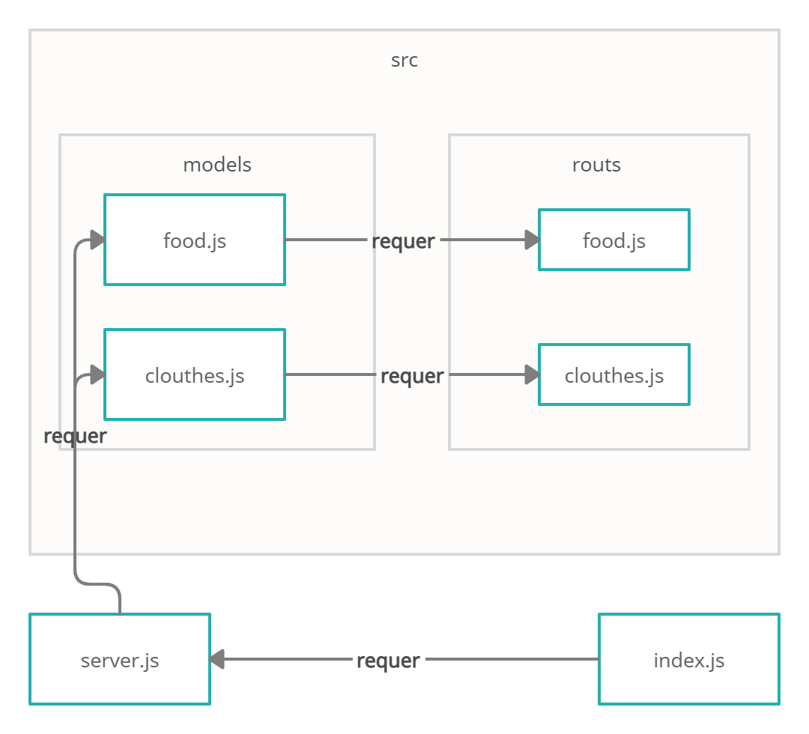

# api-server

# basic-express-server

* [GitHub actions](https://github.com/ahmadfrijat/basic-api-server/actions)
* [pull request](https://github.com/ahmadfrijat/basic-api-server/pull/1)
* [heroku deployment app](https://ahmad-basic-api-server.herokuapp.com/)  //  note: food bage:( /api/v1/food )  &&   clothes bage:( /api/v1/clothes ) 


# how to work :

* ```npm init -y ```
* ```npm i express dotenv cors morgan mongoose ```
* ```npm i -D jest ```

# to start mongo server :

* ```sudo service mongod start ```

# UML :

